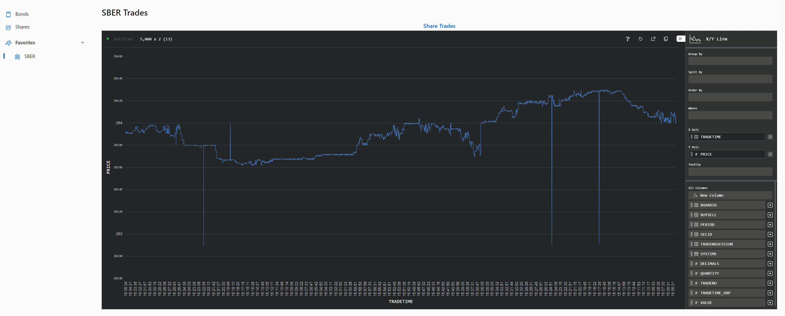
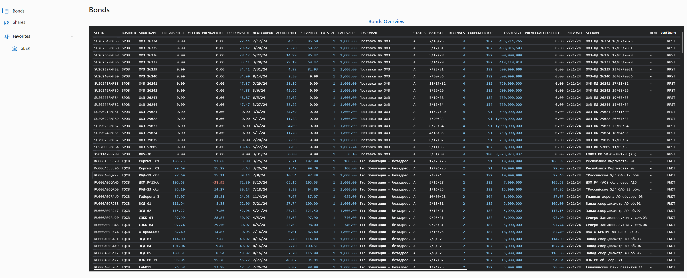
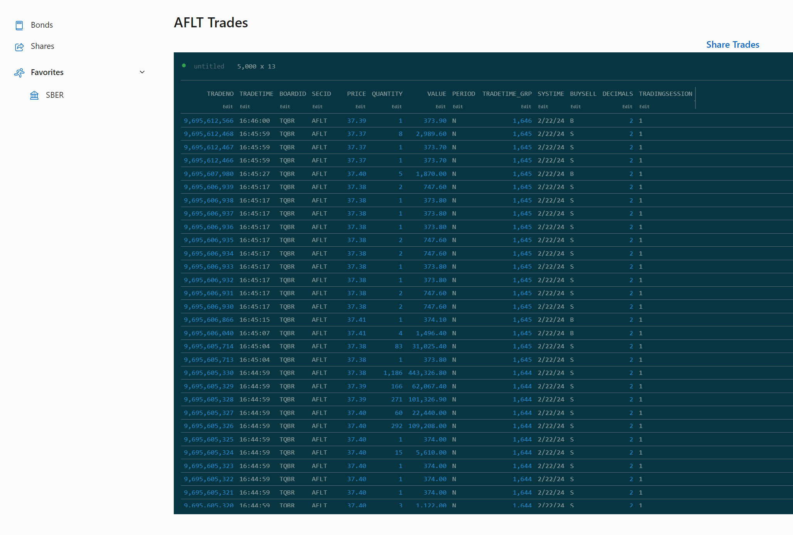
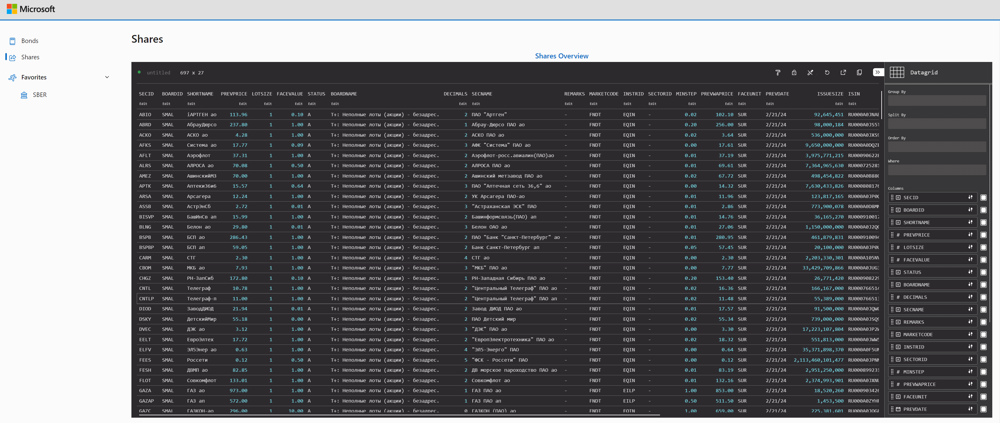
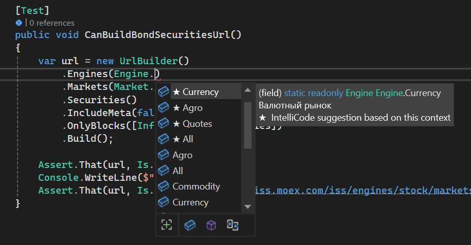
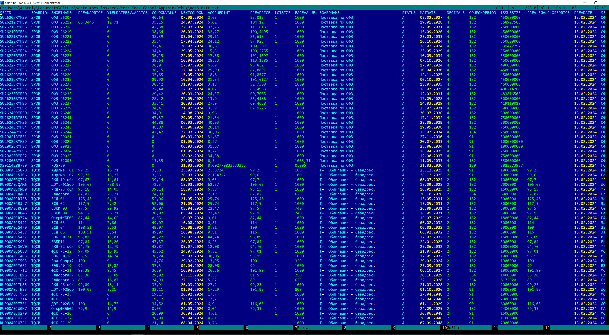

# vertr-moex-iss

Moex ISS connector

## Samples

### MOEX Screener Demo

[MOEX Screener Source Code](https://github.com/afedyanin/vertr-moex-iss)







### Url Builder



``` csharp

...
        // securities
        var url = new UrlBuilder(_baseUrl)
            .Engines(Engine.Stock)
            .Markets(Market.Stock_Bonds)
            .Securities()
            .OnlyBlocks([InfoBlockKey.Securities, InfoBlockKey.Marketdata])
            .Build();
...
        // security columns
        var url = new UrlBuilder(_baseUrl)
            .Engines(Engine.Stock)
            .Markets(Market.Stock_Bonds)
            .Securities()
            .Columns
            .OnlyBlocks([InfoBlockKey.Securities, InfoBlockKey.Marketdata])
            .Build();
...

        // trades
        var url = new UrlBuilder(_baseUrl)
            .Engines(Engine.Stock)
            .Markets(Market.Stock_Shares)
            .Securities("GAZP")
            .Trades
            .OnlyBlocks([InfoBlockKey.Trades])
            .Build();

```

### Moex Iss Api Sample

``` csharp
        var api = new MoexIssApi();

        var dataframes = await api.Securities(
            Engine.Stock,
            Market.Stock_Bonds,
            [InfoBlockKey.Securities, InfoBlockKey.Marketdata]);

        dataframes[0].PrettyPrint();
```

Build and Run console app

```
Vertr.Moex.ConsoleApp.exe > tt.txt

```

Result



## Resources

- [ISS Reference](https://iss.moex.com/iss/reference)
- [Technical resources](TECH.md)

## Similar projects

- [Обёртка над iss.moex.com на C#](https://github.com/ITGlobal/MoexIssAPI)
- [Fiss - библиотека для строго-типизированного взаимодействия с MOEX ISS](https://github.com/Kataane/Fiss)
- [C# client library and OpenAPI spec for Moex IIS](https://github.com/HavenDV/MoexIIS)
